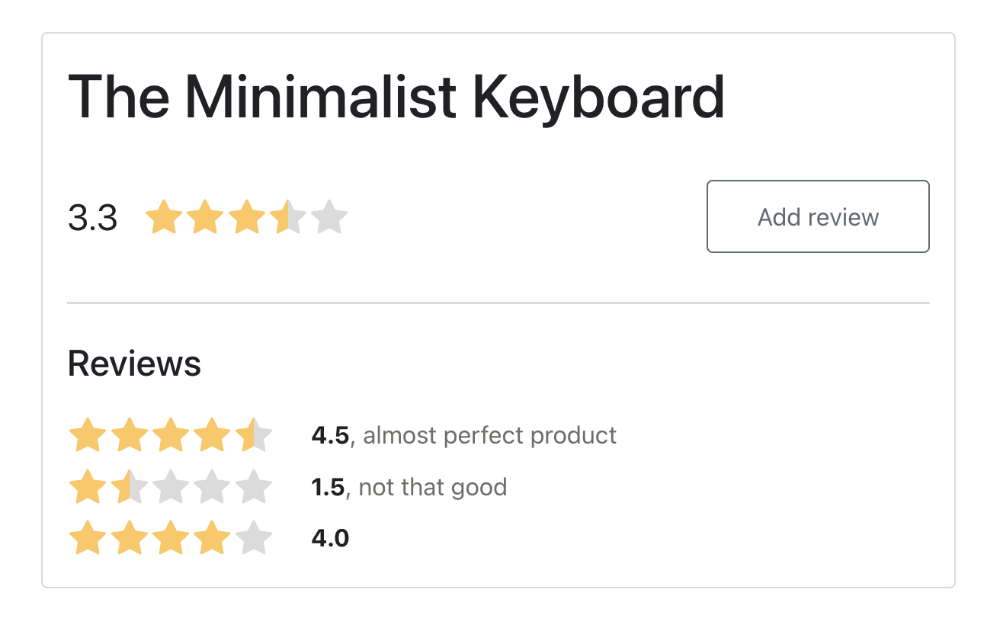

# Hoshino

This is a sample full-stack app for adding 5-star product reviews, for the purpose of demo. The repo name "hoshino" means "stars" in Japanese.



There is a [online demo](https://hoshino.tigerlab.org). If it's not live, then it's because I stopped the backend to reduce the AWS bill. Just ping me to restart it again!

Tech stack:
- `backend/` is built in NodeJS with minimal libs:
    - ExpressJS lib for a minimalist API
    - KnexJS lib for query builder
    - Postgres database, but Knex supports other SQL dbs
- `frontend/` is built in vanilla/jQuery
- `frontend-react/` is the same UI, built with React:
    - Bootstrap for UI components
- See [Pull Requests](https://github.com/one-shots/hoshino/pulls?q=) to view unsquashed changes

If this was a real project, then the next steps would be to:
- Adopt conventions for names, semantics, folder structure, error handling, input validation, unit tests, etc.
- Improve security, add users and auth
- Improve UI: pagination, more CRUD components, responsive layout
- Improve vanilla/jquery frontend:
    - Use SASS/SCSS
    - Use a tool like Grunt/Gulp/etc to build the static files, better browser compatibility
- Improve React frontend:
    - Explore state management e.g. Redux, MobX, ..
    - Explore nested styling in each component, e.g. `styled-components`
- Use WebSocket showing reviews in real-time, which is currently done with HTTP polling 
- Use TypeScript, which should reduce bugs and encourage cleaner code as the project grows
- The API is currently RESTful, but GraphQL can be helpful, such as reducing client requests and making the frontend dev experience more intuitive

## Local Development

### Setup locally
Install Postgres locally and create db:

```shell script
psql -U postgres -c 'CREATE DATABASE hoshino;'
```

Create _backend/.env_ with:

```shell script
# Env vars
DATABASE_URL=postgresql://localhost:5432/hoshino?sslmode=disable
``` 

Setup db:

```shell script
cd backend
npm install
npm run migrate
npm run seed
```

### Run locally

Run server:

```shell script
cd backend
npm i
npm start
```

Run server with Docker:

```shell script
docker build -f Dockerfile -t hoshino .
docker run -p 3001:3001 --env-file=backend/.env --add-host=host.docker.internal:host-gateway hoshino
```

Run vanilla/jQuery frontend:
- Use local server like Python's SimpleHTTPServer
- Or the [serve](https://www.npmjs.com/package/serve) package and run `serve -p 3000 frontend/`

Run React frontend
```shell script
cd frontend-react/
yarn install
yarn start
``` 

## Deploy

Deploy backend to Heroku/etc as Node app, or build it in Docker and deploy into AWS/etc.:

```shell script
cd backend/
npm run docker:build
```

Build frontend files, which can be served on Netlify/etc.: 

```shell script
cd frontend-react/
yarn build
```
